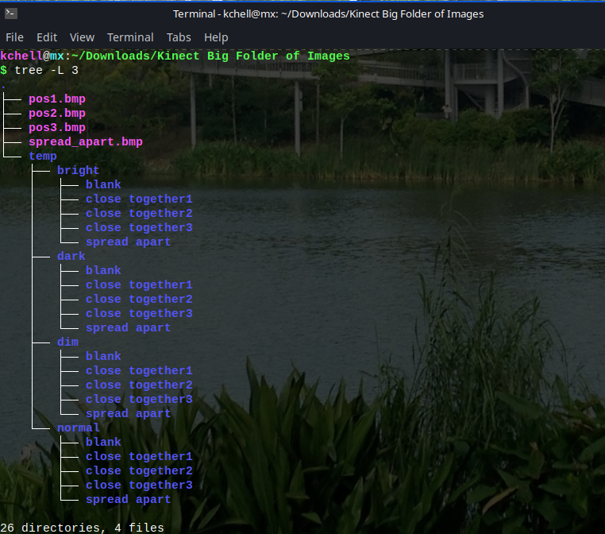

# Kinect-Quadraplegic-HARMONIE
HARMONIE: Hybrid Augmented Reality Multimodal Operation Neural Integration Environment - Integrates Kinect v2 for real-time object detection via image processing and linear classifiers, enhancing BCI-driven control of dexterous robotic prosthetics like the Modular Prosthetic Limb (MPL) for users with motor impairments.

Codes:

HARMONIE Project
├── README.md
├── main_code.m
│   └── Orchestrates workflow: Loads blank/trial IR images from directories, calls backgroundsubtractionseg on first pair, exports to Segmentation_testing/export [file:21]
├── backgroundsubtractionseg.m
│   └── Core segmentation: Subtracts blank from trial IR images (Kinect v2), applies threshold (4000), Gaussian filter, hole-filling, Canny edges; detects objects via regionprops, crops/resizes to 200x200 PNGs (binary/color), computes max/min radius from boundary distances, prompts user label, saves .mat with image/label/radii
├── lda_classifier.m
│   └── Trains Linear Discriminant Analysis (LDA): Loads .mat files, plots maxRadius vs minRadius scatter by labels (Sphere/Cylinder/Rectangle/Other), fits classifier on [maxRadius, minRadius], visualizes decision boundary
└── hog_feature_vector.m
    └── Extracts HOG features: Computes gradients (Ix/Iy), angles/magnitudes, Gaussian filter; bins into 9-bin histograms per 8x8 cell (bilinear interpolation 0-180°), forms 36-D block features (2x2 cells), L1/L2 normalizes entire vector, clips >0.2, final L2 norm (Dalal-Triggs implementation)

Data:
Folder of roughly 82 directories, 3962 files images with Infrared Information Embedded in them.
''

Contact karthikc.1729@gmail.com for full files (4gb, 82 directories, 3962 files)
kchell@mx:/Downloads/Kinect Big Folder of Images
$ tree -L 3
.
├── pos1.bmp
├── pos2.bmp
├── pos3.bmp
├── spread_apart.bmp
└── temp
    ├── bright
    │   ├── blank
    │   ├── close together1
    │   ├── close together2
    │   ├── close together3
    │   └── spread apart
    ├── dark
    │   ├── blank
    │   ├── close together1
    │   ├── close together2
    │   ├── close together3
    │   └── spread apart
    ├── dim
    │   ├── blank
    │   ├── close together1
    │   ├── close together2
    │   ├── close together3
    │   └── spread apart
    └── normal
        ├── blank
        ├── close together1
        ├── close together2
        ├── close together3
        └── spread apart

26 directories, 4 files

